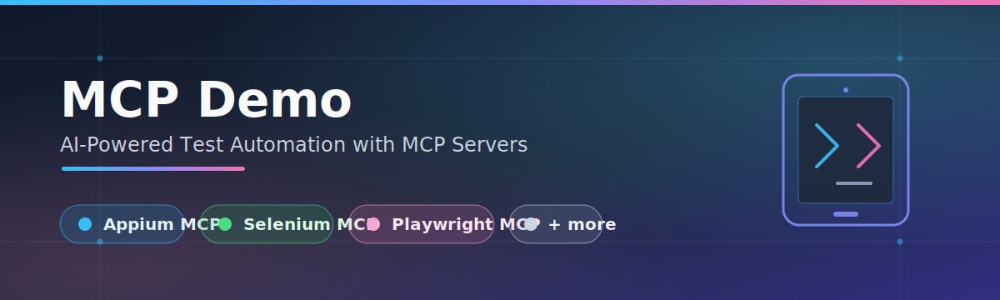

# MCP Demo

This repo is a collection of working demos showing how **MCP (Model Context Protocol) servers** can drive real test automation frameworks through natural-language prompts via AI assistants (Claude CLI, Cline-based AI-IDEs like Kiro/Cursor/Windsurf/Antigravity, etc.).

Each subfolder wraps a different automation framework as an MCP server, exposing its capabilities as AI-agent-callable tools — letting you write and run tests by describing intent instead of hand-coding every step.

## Demos

| Framework | Description | Link |
|---|---|---|
| **Appium MCP** | Drive Android/iOS mobile test sessions (local emulators/simulators or cloud devices) with natural-language prompts. | [appium-mcp](https://github.com/hjsblogger/mcp-demo/tree/main/appium-mcp) |
| **Selenium MCP** | Web browser automation via Selenium, exposed as MCP tools. | Coming soon |
| **Playwright MCP** | Web browser automation via Playwright, exposed as MCP tools. | Coming soon |
| **more...** | Additional MCP-wrapped automation frameworks. | Coming soon |

## Why MCP for Test Automation?

MCP standardizes how AI assistants call external tools. By wrapping an automation framework's API as an MCP server, any MCP-compatible AI client can:

- Interpret a natural-language test instruction
- Select and invoke the right tool call (find element, tap, click, assert, screenshot, etc.)
- Drive the underlying framework (Appium, Selenium, Playwright) against real or cloud devices/browsers
- Optionally generate maintainable test code (Page Object Model, etc.) from the session

## Getting Started

Each demo folder is self-contained with its own README, setup instructions, and example agent prompts. Start with [appium-mcp](https://github.com/hjsblogger/mcp-demo/tree/main/appium-mcp) for a full walkthrough of the pattern.
