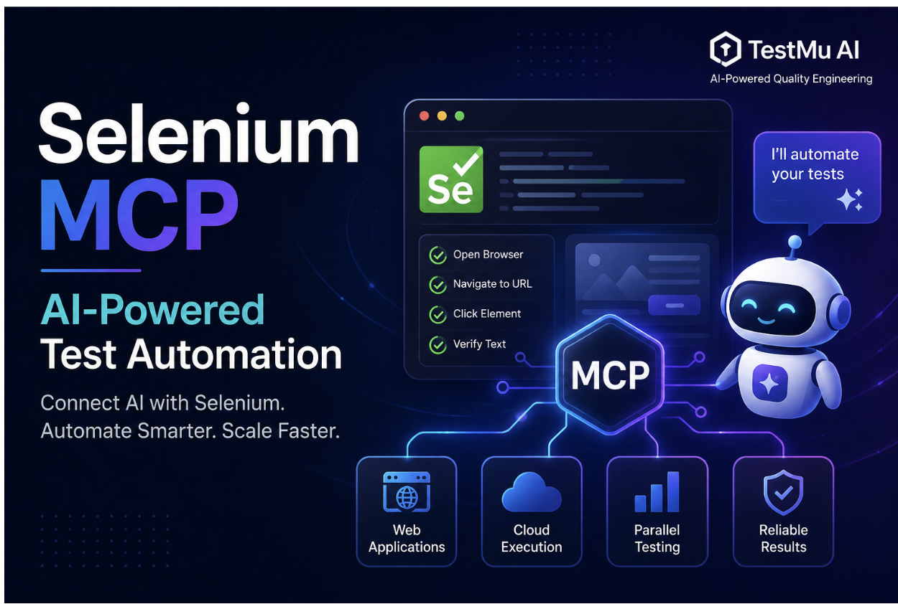
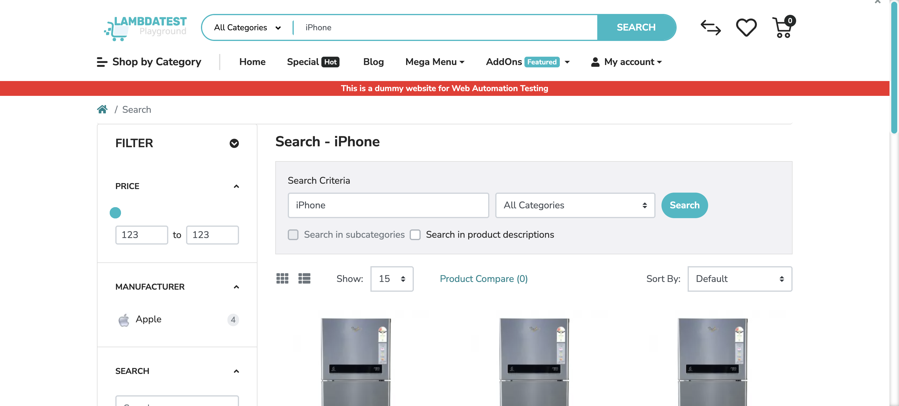

# Selenium MCP: AI-Powered Test Automation



This repo is a working demo of **Selenium MCP** — an MCP server that wraps Selenium WebDriver's browser automation capabilities as AI-agent-callable tools, letting you drive Chrome/Firefox/Edge/Safari sessions with natural-language prompts via Claude Code, Warp, Kiro, or any other MCP-compatible client. It also extends the community server with **TestMu AI (LambdaTest) cloud grid** support for remote, cross-browser runs.

> Based on the companion blog: *Selenium MCP: AI-Powered Test Automation*

## Table of Contents
- [What is MCP (Model Context Protocol)?](#what-is-mcp-model-context-protocol)
- [What is Selenium MCP?](#what-is-selenium-mcp)
- [Selenium MCP Architecture](#selenium-mcp-architecture)
- [Repo Layout](#repo-layout)
- [Setup](#setup)
- [Running Tests](#running-tests)
- [Best Practices](#best-practices)
- [Appendix: Full Tool & Resource Reference](#appendix-full-tool--resource-reference)

## What is MCP (Model Context Protocol)?

MCP is an open standard, introduced by Anthropic in late 2024, for connecting AI applications to external tools and systems — often called "USB-C for AI applications" since it gives AI models a universal connector to any external tool or service, instead of free-form text. AI assistants (Claude, ChatGPT, Codex) and AI-native IDEs/tools (Kiro, Cursor, VS Code, Warp) have all adopted it as a "build once, integrate everywhere" standard, opening up new possibilities in both mobile and web automation.

## What is Selenium MCP?

Akin to Appium MCP for mobile testing, Selenium MCP brings AI-powered automation capabilities to web testing. It lets AI agents interact directly with web browsers using natural language:

- Locate elements using natural-language or accessibility-based detection
- Interact with web elements (click, hover, type, upload files)
- Navigate pages, manage windows/tabs, and handle frames/iframes
- Capture screenshots and inspect the DOM
- Manage cookies, alerts, and read console/network diagnostics via WebDriver BiDi

The open-source community server (`@angiejones/mcp-selenium`) is maintained by **Angie Jones**. Srinivasan Sekar, an Appium maintainer and Selenium contributor, had an insightful discussion with Angie Jones at Selenium & Appium Conf 2025 about MCP, AI ethics, and more — [watch it here](https://www.youtube.com/watch?v=DTd0W-RQRvc).

At the time of writing, the latest community version is `0.2.3`, supporting **Chrome, Firefox, Edge, and Safari**.

> **Safari note:** requires macOS. Run `sudo safaridriver --enable` once and enable "Allow Remote Automation" in Safari → Settings → Developer. No headless mode.

While the official server works seamlessly with local browsers, it doesn't natively support a remote/cloud Selenium grid. This repo is built on a **fork** ([hjsblogger/mcp-selenium](https://github.com/hjsblogger/mcp-selenium)) that adds `SELENIUM_REMOTE_URL` support so the same tool calls can drive sessions on **TestMu AI**'s cloud grid instead of a local browser — published to npm as [`@hjsblogger/mcp-selenium-testmuai`](https://www.npmjs.com/package/@hjsblogger/mcp-selenium-testmuai).

### Tool calls exposed by the server

| Tool call | Purpose |
|---|---|
| `start_browser` | Launches a browser session in Chrome, Firefox, Edge, or Safari |
| `navigate` | Navigates the active session to a URL |
| `interact` | Mouse actions on an element: click, double-click, right-click, hover |
| `send_keys` | Clears an element and enters text |
| `get_element_text` | Retrieves the text content of an element |
| `get_element_attribute` | Retrieves an attribute value (e.g. `href`, `value`, `class`) |
| `press_key` | Simulates a keyboard key press (e.g. `Enter`, `Tab`) |
| `upload_file` | Uploads a file through a file input element |
| `take_screenshot` | Captures a screenshot of the current page |
| `close_session` | Closes the active browser session |
| `execute_script` | Executes JavaScript for advanced interactions |
| `window` | Lists, switches, or closes browser windows/tabs |
| `frame` | Switches context into an iframe or back to the main page |
| `alert` | Handles alert/confirm/prompt dialogs |
| `add_cookie` / `get_cookies` / `delete_cookie` | Manages cookies on the session |
| `diagnostics` | Reads console logs, JS errors, or network activity via WebDriver BiDi |

Two read-only **resources** are also exposed: `browser-status://current` (active session status) and `accessibility://current` (a compact accessibility-tree snapshot of the page — cheaper and more reliable than a full HTML dump for finding locators).

## Selenium MCP Architecture

The Selenium MCP server connects AI assistants with Selenium-based browser automation, following a layered flow:

```
AI Client -> MCP Protocol (JSON-RPC 2.0, stdio) -> Selenium MCP Server -> Selenium WebDriver -> Browser
```

#### 1. AI Client Layer
AI assistants (Claude, ChatGPT, Gemini) and AI-native IDEs (Cursor, Kiro, Warp) interpret user intent from natural-language prompts and issue tool calls.

#### 2. MCP Protocol Layer
The server talks over **stdio**, not HTTP — all requests/responses are JSON-RPC 2.0 messages sent via `StdioServerTransport` from the official MCP SDK. Since the server runs as a local subprocess spawned by the client, there's no network port or auth handshake needed.

#### 3. Selenium MCP Server
Exposes browser automation as callable tools (see table above). On each tool call it maps the request to the corresponding WebDriver operation, executes it against the target browser, and routes the result back through the protocol layer.

#### 4. Selenium WebDriver + Browser
`start_browser` opens a session against a local browser, or — when `SELENIUM_REMOTE_URL` is set — against a remote grid like TestMu AI. All subsequent tool calls (`navigate`, `interact`, `take_screenshot`, ...) execute against whichever session is currently active.

## Repo Layout

| Path | Purpose |
|---|---|
| `src/lib/server.js` | All server logic: 18 tool definitions, 2 resources, session state, cleanup |
| `src/lib/accessibility-snapshot.js` | Browser-side JS injected via `execute_script` to build the accessibility tree |
| `bin/mcp-selenium.js` | CLI entry point, spawns `server.js` as a child process |
| `test/mcp-client.mjs` + `test/*.test.mjs` | Test suite — a reusable MCP client driving the real server over stdio |
| `instructions/local-selenium-agent.md` | Agent instructions for the local Chrome smoke test |
| `instructions/cloud-testmuai-selenium-agent.md` | Agent instructions for the TestMu AI parallel Chrome+Firefox test |
| `instructions/web-testmu-selenium-agent.md` | Subagent-per-browser workflow for cross-browser TestMu AI runs |
| `capabilities/lt-web-capabilities.example.json` | Example TestMu AI capability entries (browser/platform/version/build/name) |
| `.claude/commands/local-selenium-agent.md` | Claude Code slash command: `/local-selenium-agent` |
| `.claude/commands/cloud-testmuai-selenium-agent.md` | Claude Code slash command: `/cloud-testmuai-selenium-agent` |
| `.mcp.json` | Project-level MCP server config (`selenium-mcp-local`, `selenium-mcp-cloud`) |
| `docs/images/` | Screenshots referenced in this README |

## Setup

### Prerequisites
- Node.js + npm/npx
- Chrome, Firefox, Edge, or Safari installed locally (for local runs — Selenium Manager resolves the matching driver automatically, no separate driver install needed)
- An MCP-compatible client: Claude Code, Warp, Kiro, Cursor, Windsurf, etc.
- A TestMu AI (LambdaTest) account, for cloud runs

### Install
```bash
# Local (community package)
npx -y @angiejones/mcp-selenium@latest

# Cloud-enabled fork used by this repo
npx -y @hjsblogger/mcp-selenium-testmuai@latest
```

### Configure with Claude Code CLI

Register the local server directly:
```bash
claude mcp add selenium --npx -y @angiejones/mcp-selenium@latest
```

Or add both entries to `.mcp.json` in the project root — this repo's `.mcp.json` defines `selenium-mcp-local` (no env vars, launches a local browser) and `selenium-mcp-cloud` (points at TestMu AI's hub):
```json
{
  "mcpServers": {
    "selenium-mcp-local": {
      "type": "stdio",
      "command": "npx",
      "args": ["-y", "@angiejones/mcp-selenium"],
      "env": {}
    },
    "selenium-mcp-cloud": {
      "type": "stdio",
      "command": "npx",
      "args": ["-y", "@hjsblogger/mcp-selenium-testmuai@latest"],
      "env": {
        "SELENIUM_REMOTE_URL": "https://hub.lambdatest.com/wd/hub",
        "LT_USERNAME": "${LT_USERNAME}",
        "LT_ACCESS_KEY": "${LT_ACCESS_KEY}"
      }
    }
  }
}
```

Export TestMu AI credentials before running cloud sessions:
```bash
export LT_USERNAME="YOUR_LT_USERNAME"
export LT_ACCESS_KEY="YOUR_LT_ACCESS_KEY"
```

> **Security:** never hard-code `LT_USERNAME`/`LT_ACCESS_KEY` in the config file — always pass them as environment variables.

### Configure with Warp

Warp (macOS/Linux/Windows) has built-in support for AI agents and MCP servers:

1. Open `Warp → Settings → Settings`, search for **MCP servers**, and click **Add**.
2. Paste the same `mcpServers` JSON shown above and click **Save**.
3. Once added, Warp lists all tools exposed by the server (`start_browser`, `navigate`, `send_keys`, ...).

### Configure with Kiro / other AI-IDEs

Kiro has native MCP support, configurable at the workspace or user level:
- Workspace: `<project-root>/.kiro/settings/mcp.json`
- User: `~/.kiro/settings/mcp.json`

```json
{
  "mcpServers": {
    "selenium": {
      "command": "npx",
      "args": ["-y", "@angiejones/mcp-selenium@latest"]
    }
  }
}
```

If installed globally (`npm install -g @angiejones/mcp-selenium`), point `command` at the `mcp-selenium` binary instead:
```json
{
  "mcpServers": {
    "selenium": { "command": "mcp-selenium" }
  }
}
```

The same process applies to other MCP-compatible AI-IDEs (Cursor, Windsurf, VS Code, Continue, Zed) — only the config file's location and exact key format differ.

## Running Tests

### Local: Chrome smoke test (`/local-selenium-agent`)

Uses the `selenium-mcp-local` server — a single local Chrome session, no remote grid or credentials needed. Scenario (see `instructions/local-selenium-agent.md`):

```
Start a local Chrome browser session and maximize the window.
Navigate to https://ecommerce-playground.lambdatest.io/.
In the search box, type iPhone and click the Search button.
Wait for the results page to load, then verify the page title contains iPhone. Fail the test if it doesn't.
Close the browser session at the end, whether the assertion passes or fails.
```

Run it with the slash command:
```
/local-selenium-agent
```

Search results page after the assertion passes (`document.title` → `"Search - iPhone"`):

<p>
  
</p>

### Cloud: TestMu AI parallel Chrome + Firefox (`/cloud-testmuai-selenium-agent`)

Uses the `selenium-mcp-cloud` server to run a search-to-checkout flow on **two browsers in parallel** on the TestMu AI grid, both tagged under the build name `TestMu AI - Selenium MCP Parallel Execution Demo` so they show up grouped on the dashboard. Scenario (see `instructions/cloud-testmuai-selenium-agent.md`):

```
1. Launch a maximized cloud browser session on the TestMu AI grid.
2. Navigate to the LambdaTest e-commerce playground.
3. Search for "iPhone" and verify the results page title contains "iPhone".
4. Add the first search result to the cart.
5. Click through to checkout.
6. Wait five seconds, then verify the URL reflects the checkout flow.
7. Close the browser session and mark the test Passed or Failed on the TestMu AI dashboard.
```

Run it with the slash command:
```
/cloud-testmuai-selenium-agent
```

This server tracks exactly **one active browser session per MCP connection** — there's no way to pass a session ID back into a tool call to select which browser you mean. To get real Chrome+Firefox parallelism, the command dispatches **one subagent per browser**, each opening its own connection to `selenium-mcp-cloud`, all in a single batch (see `instructions/web-testmu-selenium-agent.md` for the full reasoning). Each subagent reports back its session ID and TestMu AI dashboard link; the orchestrator waits for both before producing a combined pass/fail summary.

#### Example cloud run

The `testmu-mcp-smoke-test.mjs` example in the [fork's `examples/`](https://github.com/hjsblogger/mcp-selenium/tree/testmu-ai-selenium-mcp/examples) folder drives the same MCP-over-TestMu-AI path with a single Chrome/Windows 11 session — the prompt below describes the scenario, and an AI coding agent (Claude Code) implemented and ran it end to end against the MCP server:

<p>
  
</p>

Executing against a live TestMu AI Chrome session:

<p>
  
</p>

<p>
  
</p>

The resulting session on the TestMu AI dashboard, with the recorded video and full command log:

<p>
  
</p>

## Best Practices

- **Keep local vs. cloud as separate MCP server entries** (`selenium-mcp-local` / `selenium-mcp-cloud`) and never hard-code `LT_USERNAME`/`LT_ACCESS_KEY` in config files — pass them as environment variables.
- **One connection = one active session.** For genuine multi-browser parallelism, open one MCP connection per browser (e.g. via subagents) instead of reusing a single connection sequentially.
- **Read `accessibility://current` before hunting for locators** — it's a compact, structured snapshot of interactive elements, cheaper and more reliable than parsing full HTML.
- **`send_keys` clears the field first** — no need to manually clear before typing.
- **`headless` is ignored on remote/cloud sessions** since the grid already runs its own datacenter browsers; it only applies to local runs.
- **Always write teardown into agent instructions** — call `close_session` regardless of pass/fail. For TestMu AI runs, call the status hook immediately before closing so the dashboard reflects the right result:
  ```
  execute_script:
    script: 'lambda-hook: {"action":"setTestStatus","arguments":{"status":"passed","remark":"<summary>"}}'
  ```
- **Package repeatable flows as `instructions/*.md` + `.claude/commands/*.md` slash commands** (as done here with `/local-selenium-agent` and `/cloud-testmuai-selenium-agent`) so runs stay consistent across invocations.

## Appendix: Full Tool & Resource Reference

Complete parameter reference for all 18 tools and 2 resources exposed by `src/lib/server.js`. The summary table under [What is Selenium MCP?](#what-is-selenium-mcp) covers the "what"; this covers the exact inputs.

<details>
<summary><strong>Tools</strong></summary>

### start_browser
Launches a browser session.

| Parameter | Type | Required | Description |
|-----------|------|----------|-------------|
| browser | string | Yes | `chrome`, `firefox`, `edge`, or `safari` |
| options | object | No | `{ headless: boolean, arguments: string[], platform: string, browserVersion: string, build: string, name: string }`. The last four apply only to remote/cloud grid sessions — see [Configure with Claude Code CLI](#configure-with-claude-code-cli). |

### navigate
Navigates to a URL.

| Parameter | Type | Required | Description |
|-----------|------|----------|-------------|
| url | string | Yes | URL to navigate to |

### interact
Performs a mouse action on an element.

| Parameter | Type | Required | Description |
|-----------|------|----------|-------------|
| action | string | Yes | `click`, `doubleclick`, `rightclick`, or `hover` |
| by | string | Yes | Locator strategy: `id`, `css`, `xpath`, `name`, `tag`, `class` |
| value | string | Yes | Value for the locator strategy |
| timeout | number | No | Max wait in ms (default: 10000) |

### send_keys
Types text into an element. Clears the field first.

| Parameter | Type | Required | Description |
|-----------|------|----------|-------------|
| by | string | Yes | Locator strategy |
| value | string | Yes | Locator value |
| text | string | Yes | Text to enter |
| timeout | number | No | Max wait in ms (default: 10000) |

### get_element_text
Gets the text content of an element.

| Parameter | Type | Required | Description |
|-----------|------|----------|-------------|
| by | string | Yes | Locator strategy |
| value | string | Yes | Locator value |
| timeout | number | No | Max wait in ms (default: 10000) |

### get_element_attribute
Gets an attribute value from an element.

| Parameter | Type | Required | Description |
|-----------|------|----------|-------------|
| by | string | Yes | Locator strategy |
| value | string | Yes | Locator value |
| attribute | string | Yes | Attribute name (e.g., `href`, `value`, `class`) |
| timeout | number | No | Max wait in ms (default: 10000) |

### press_key
Presses a keyboard key.

| Parameter | Type | Required | Description |
|-----------|------|----------|-------------|
| key | string | Yes | Key to press (e.g., `Enter`, `Tab`, `a`) |

### upload_file
Uploads a file via a file input element.

| Parameter | Type | Required | Description |
|-----------|------|----------|-------------|
| by | string | Yes | Locator strategy |
| value | string | Yes | Locator value |
| filePath | string | Yes | Absolute path to the file |
| timeout | number | No | Max wait in ms (default: 10000) |

### take_screenshot
Captures a screenshot of the current page.

| Parameter | Type | Required | Description |
|-----------|------|----------|-------------|
| outputPath | string | No | Save path. If omitted, returns base64 image data. |

### close_session
Closes the current browser session. No parameters.

### execute_script
Executes JavaScript in the browser. Use for advanced interactions not covered by other tools (e.g., drag and drop, scrolling, reading computed styles, DOM manipulation).

| Parameter | Type | Required | Description |
|-----------|------|----------|-------------|
| script | string | Yes | JavaScript code to execute |
| args | array | No | Arguments accessible via `arguments[0]`, etc. |

### window
Manages browser windows and tabs.

| Parameter | Type | Required | Description |
|-----------|------|----------|-------------|
| action | string | Yes | `list`, `switch`, `switch_latest`, or `close` |
| handle | string | No | Window handle (required for `switch`) |

### frame
Switches focus to a frame or back to the main page.

| Parameter | Type | Required | Description |
|-----------|------|----------|-------------|
| action | string | Yes | `switch` or `default` |
| by | string | No | Locator strategy (for `switch`) |
| value | string | No | Locator value (for `switch`) |
| index | number | No | Frame index, 0-based (for `switch`) |
| timeout | number | No | Max wait in ms (default: 10000) |

### alert
Handles browser alert, confirm, or prompt dialogs.

| Parameter | Type | Required | Description |
|-----------|------|----------|-------------|
| action | string | Yes | `accept`, `dismiss`, `get_text`, or `send_text` |
| text | string | No | Text to send (required for `send_text`) |
| timeout | number | No | Max wait in ms (default: 5000) |

### add_cookie
Adds a cookie. Browser must be on a page from the cookie's domain.

| Parameter | Type | Required | Description |
|-----------|------|----------|-------------|
| name | string | Yes | Cookie name |
| value | string | Yes | Cookie value |
| domain | string | No | Cookie domain |
| path | string | No | Cookie path |
| secure | boolean | No | Secure flag |
| httpOnly | boolean | No | HTTP-only flag |
| expiry | number | No | Unix timestamp |

### get_cookies
Gets cookies. Returns all or a specific one by name.

| Parameter | Type | Required | Description |
|-----------|------|----------|-------------|
| name | string | No | Cookie name. Omit for all cookies. |

### delete_cookie
Deletes cookies. Deletes all or a specific one by name.

| Parameter | Type | Required | Description |
|-----------|------|----------|-------------|
| name | string | No | Cookie name. Omit to delete all. |

### diagnostics
Gets browser diagnostics captured via WebDriver BiDi (auto-enabled when supported).

| Parameter | Type | Required | Description |
|-----------|------|----------|-------------|
| type | string | Yes | `console`, `errors`, or `network` |
| clear | boolean | No | Clear buffer after returning (default: false) |

</details>

<details>
<summary><strong>Resources</strong></summary>

MCP resources provide read-only data that clients can access without calling a tool.

### browser-status://current
Returns the current browser session status (active session ID or "no active session").

| Property | Value |
|----------|-------|
| MIME type | `text/plain` |
| Requires browser | No |

### accessibility://current
Returns an accessibility tree snapshot of the current page — a compact, structured JSON representation of interactive elements and text content. Much smaller than full HTML. Useful for understanding page layout and finding elements to interact with.

| Property | Value |
|----------|-------|
| MIME type | `application/json` |
| Requires browser | Yes |

</details>

## Have feedback or need assistance?

Feel free to fork the repo and contribute to make it better! Credit to **Angie Jones** for the original `@angiejones/mcp-selenium` server.

Email to [himanshu[dot]sheth[at]gmail[dot]com](mailto:himanshu.sheth@gmail.com) for any queries or ping me on the following social media sites:

<b>LinkedIn</b>: [@hjsblogger](https://linkedin.com/in/hjsblogger)<br/>
<b>Twitter</b>: [@hjsblogger](https://www.twitter.com/hjsblogger)
